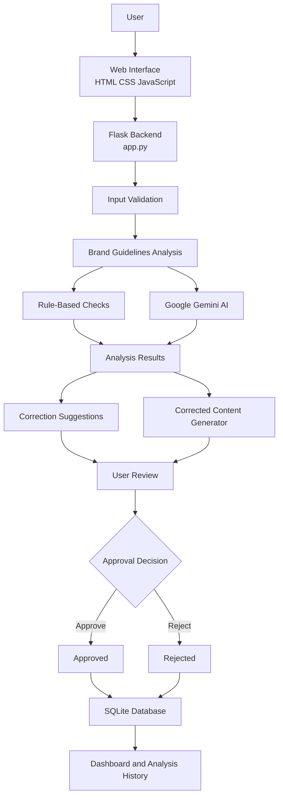

# INKLOOM AI – System Architecture

```mermaid
flowchart TD
    A[User] --> B[Web Interface<br/>HTML CSS JavaScript]
    B --> C[Flask Backend<br/>app.py]

    C --> D[Input Validation]
    D --> E[Brand Guidelines Analysis]
    E --> F[Rule-Based Checks]
    E --> G[Google Gemini AI]

    F --> H[Analysis Results]
    G --> H

    H --> I[Correction Suggestions]
    H --> J[Corrected Content Generator]

    I --> K[User Review]
    J --> K

    K --> L{Approval Decision}
    L -->|Approve| M[Approved]
    L -->|Reject| N[Rejected]

    M --> O[SQLite Database]
    N --> O

    O --> P[Dashboard and Analysis History]
```
